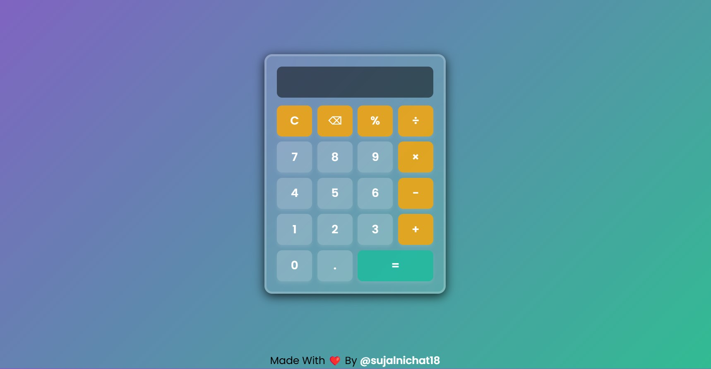

# Calculator By SN 

A stylish and interactive calculator built with HTML, CSS, and JavaScript. This calculator features a modern UI with a glassmorphism effect and includes full keyboard support.  

## 📸 Preview  
  

## ✨ Features  
- **Responsive Design** - Works on different screen sizes  
- **Glassmorphism UI** - Elegant and modern look  
- **Keyboard Support** - Use your keyboard for calculations  
- **Basic Operations** - Addition, subtraction, multiplication, division, and percentage  
- **Clear & Backspace** - Easily remove input  

## 🛠️ Technologies Used  
- **HTML** - Structure of the calculator  
- **CSS** - Styling with a modern gradient background and effects  
- **JavaScript** - Functionality and keyboard support  

## 🚀 How to Use  
1. Clone this repository or download the files.  
2. Open `index.html` in any web browser.  
3. Click buttons or use the keyboard to perform calculations.  

## 📜 File Structure  
```
/calculator
│── index.html    # Main HTML file  
│── styles.css    # CSS for styling  
│── script.js     # JavaScript for functionality  
│── calculator_demo.jpg  # Preview image  
```

## 🎮 Keyboard Shortcuts  
| Key | Function |
|------|-----------|
| Numbers (0-9) | Input numbers |
| `+`, `-`, `*`, `/`, `%` | Perform operations |
| `Enter` | Calculate result |
| `Backspace` | Delete last digit |
| `Escape` | Clear display |

## 👨‍💻 Author  
Made with ❤️ by [@sujalnichat18](https://www.linkedin.com/in/sujal-nichat-1811sn/)  
